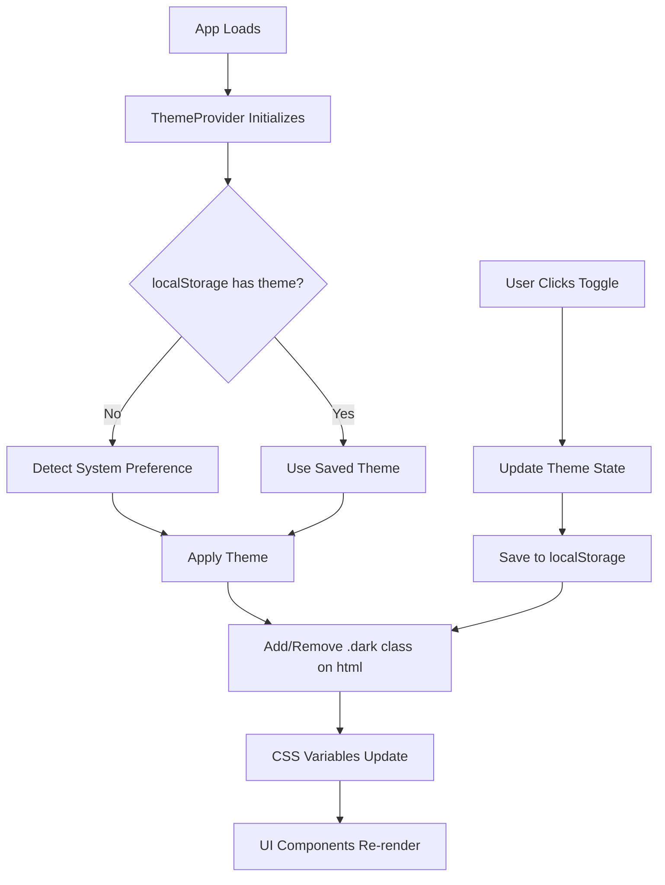

# Light/Dark Mode Implementation Guide

## Overview

This plan implements a complete light/dark mode system that:

- Automatically detects system preference on initial load
- Provides a toggle button/slider to manually switch themes
- Persists user preference in localStorage
- Uses the existing CSS variable system already defined in `index.css`

## Current State Analysis

### Existing Infrastructure

- **CSS Variables**: Both light and dark mode variables are already defined in `src/index.css` (lines 5-48)
- **Tailwind Config**: Configured to use CSS variables for theming (`tailwind.config.js`)
- **UI Components**: Radix UI components are already set up and will automatically adapt to theme changes
- **No Theme System**: Currently no way to toggle between themes or detect system preference

### Architecture Flow




## Implementation Steps

### 1. Create Theme Context and Provider

**File**: `src/contexts/ThemeContext.tsx` (new file)Create a React context that:

- Manages theme state (`"light" | "dark" | "system"`)
- Detects system preference using `window.matchMedia('(prefers-color-scheme: dark)')`
- Applies the `.dark` class to the HTML element
- Persists theme preference to localStorage
- Listens for system preference changes

**Key Features**:

- Initial load: Check localStorage → if empty, detect system preference
- System preference listener: Update theme when user changes OS theme
- Theme application: Add/remove `.dark` class on `<html>` element
- Storage key: `"screenshotgun-theme"`

### 2. Create Theme Toggle Component

**File**: `src/components/ThemeToggle.tsx` (new file)Create a toggle component with two implementation options:**Option A: Switch Component** (Recommended)

- Use existing `Switch` component from `@/components/ui/switch`
- Shows current theme state clearly
- Includes sun/moon icons from `lucide-react`

**Option B: Button with Icon**

- Use `Button` component with icon that changes based on theme
- More compact, fits in header

**Component Features**:

- Displays current theme (light/dark icon)
- Toggles between light and dark (respects system preference initially)
- Accessible with proper ARIA labels
- Smooth transitions

### 3. Integrate Theme Provider

**File**: `src/main.tsx`Wrap the app with `ThemeProvider`:

```tsx
<ThemeProvider>
  <StrictMode>
    <App />
  </StrictMode>
</ThemeProvider>
```


### 4. Add Theme Toggle to App

**File**: `src/App.tsx`Add the `ThemeToggle` component to the header section (around line 653-665), positioned in the top-right corner or next to the logo.

### 5. Update HTML Element

**File**: `index.html`Ensure the HTML element can receive the `.dark` class dynamically (no changes needed, but verify structure).

## Technical Details

### Theme Detection Logic

1. **Initial Load**:
   ```typescript
         const stored = localStorage.getItem('screenshotgun-theme')
         if (stored) return stored as 'light' | 'dark'
         return window.matchMedia('(prefers-color-scheme: dark)').matches ? 'dark' : 'light'
   ```


2. **System Preference Listener**:
   ```typescript
         const mediaQuery = window.matchMedia('(prefers-color-scheme: dark)')
         mediaQuery.addEventListener('change', (e) => {
           if (theme === 'system') {
             applyTheme(e.matches ? 'dark' : 'light')
           }
         })
   ```


3. **Theme Application**:
   ```typescript
         const root = document.documentElement
         if (resolvedTheme === 'dark') {
           root.classList.add('dark')
         } else {
           root.classList.remove('dark')
         }
   ```


### CSS Variable System

The existing CSS variables in `index.css` will automatically work:

- Light mode: Uses `:root` variables (lines 5-26)
- Dark mode: Uses `.dark` class variables (lines 28-48)
- All components use `hsl(var(--variable))` which will update automatically

### Component Integration

All existing UI components will automatically adapt because they use:

- `bg-background`, `text-foreground`, `border-border`, etc.
- These reference CSS variables that change based on `.dark` class

## Files to Create/Modify

### New Files

1. `src/contexts/ThemeContext.tsx` - Theme context and provider
2. `src/components/ThemeToggle.tsx` - Toggle button/switch component

### Modified Files

1. `src/main.tsx` - Wrap app with ThemeProvider
2. `src/App.tsx` - Add ThemeToggle component to header

## Testing Checklist

- [ ] Theme persists after page reload
- [ ] System preference is detected on first visit
- [ ] Manual toggle overrides system preference
- [ ] System preference changes update theme (when no manual override)
- [ ] All UI components adapt correctly (cards, buttons, inputs, etc.)
- [ ] Toggle is accessible (keyboard navigation, screen readers)
- [ ] No flash of wrong theme on initial load (critical for UX)

## Edge Cases to Handle

1. **Flash of Unstyled Content (FOUC)**: Apply theme class before React hydration
2. **SSR Considerations**: Check if `window` exists before accessing
3. **System Preference Changes**: Only apply if user hasn't manually set a preference
4. **localStorage Errors**: Gracefully fall back to system preference if storage fails

## Accessibility

- Toggle button has proper ARIA labels
- Keyboard navigation support (Enter/Space to toggle)